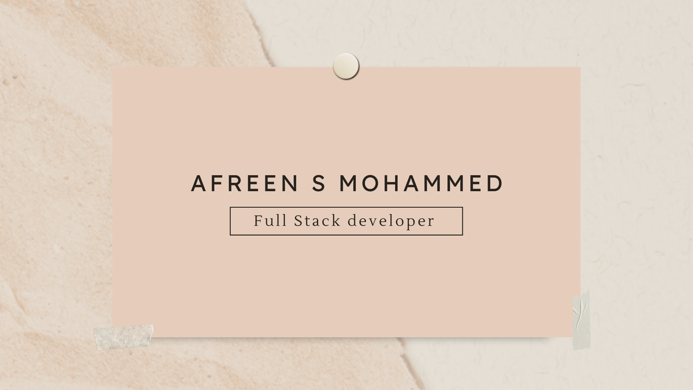

### Hi there 👋 <h2> I'm Afreen S Mohammed</h2>

<!--
**afreensafdar/afreensafdar** is a ✨ _special_ ✨ repository because its `README.md` (this file) appears on your GitHub profile.
Here are some ideas to get you started:

- 🔭 I’m currently working on ...
- 🌱 I’m currently learning ...
- 👯 I’m looking to collaborate on ...
- 🤔 I’m looking for help with ...
- 💬 Ask me about ...
- 📫 How to reach me: ...
- 😄 Pronouns: ...
- ⚡ Fun fact: ...
-->

<!-- ## 👋 &nbsp;Hey there! I'm Afreen -->

### 👨🏻‍💻 &nbsp;About Me

💡 &nbsp;I like to explore new technologies and develop software solutions and quick hacks.\
🎓 &nbsp;I’m currently working as Full Stack Software Developer Apprentice.\
🌱 &nbsp; I’m currently learning Data Structures and Algorithms.\
✍️ &nbsp;In my free time, I watch Netflix and enjoy gardening.

### 🛠 &nbsp;Tech Stack

&nbsp;
&nbsp;
&nbsp;
&nbsp;
\
&nbsp;
&nbsp;
&nbsp;
&nbsp;
\
&nbsp;
&nbsp;
&nbsp;

\

### ⚙️ &nbsp;GitHub Analytics

### 🤝🏻 &nbsp;Connect with Me

  
  (https://www.codewars.com/users/afreensafdar)
  

